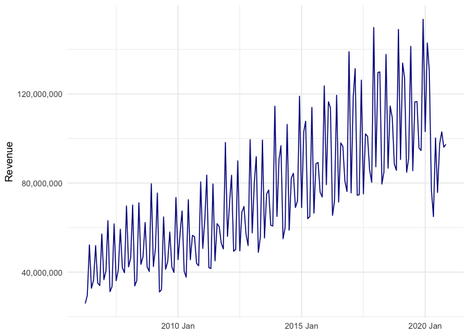

<!-- README.md is generated from README.Rmd. Please edit that file -->

# tax4sa

<!-- badges: start -->

<!-- badges: end -->

This is a minimal package to help with the compilation and analysis of
tax data in South Africa. The package only contains four main sets of
data, three functions and the personal income tax tables from 1995/96 to
2021/22.

The data includes:

  - Annual tax revenue collections from 1983/84, as published in the
    [Budget Review each
    year](http://www.treasury.gov.za/documents/national%20budget/default.aspx)
  - Monthly tax revenue collections from April 2002, as published [in
    the monthly financing
    statements](http://www.treasury.gov.za/comm_media/press/monthly/default.aspx)
  - Quarterly Bulletin data from the [South African Reserve
    Bank](https://www.resbank.co.za/en/home/publications/quarterly-bulletin1/download-information-from-xlsx-data-files)
  - Economic statistics from [Statistics South
    Africa](http://www.statssa.gov.za/?page_id=1847)

The three functions and the personal income tax tables are intended to
help with calculating tax liabilities, particularly when used with the
[administrative data from
SARS](https://sa-tied.wider.unu.edu/sites/default/files/pdf/SATIED_WP36_Ebrahim_Axelson_March_2019.pdf).

## Installation

You can install the package from [GitHub](https://github.com/) with:

``` r
# install.packages("remotes")
remotes::install_github("chrisaxelson/tax4sa")
```

## Example

The data can be accessed by directly entering either `SARS_annual`,
`SARS_monthly`, `STATSSA` or `SARB` and is in a tidy format to ease
analysis within R. The revenue data is split by three revenue
classifications in columns `T1`, `T2` and `T3` and all figures are in
ZAR 000’s. The dataframes `SARB_descriptions` and `STATSSA_descriptions`
are also available to help with the details of each variable in those
two sets of data.

``` r
library(tax4sa)
library(dplyr)
library(knitr)

# Check revenue data
SARS_annual %>% 
  filter(Fiscal_year == 2021) %>%  
  select(T1:T3, Revenue) %>% 
  head() %>% 
  kable(format.args = list(big.mark = ","))
```

| T1                          | T2                          | T3                                                  |       Revenue |
| :-------------------------- | :-------------------------- | :-------------------------------------------------- | ------------: |
| Taxes on income and profits | Taxes on income and profits | Taxes on income and profits                         | 718,180,499.0 |
| Taxes on income and profits | Personal income tax         | Personal income tax                                 | 487,006,277.5 |
| Taxes on income and profits | Tax on corporate income     | Tax on corporate income                             | 227,434,992.5 |
| Taxes on income and profits | Tax on corporate income     | Corporate income tax                                | 202,099,325.8 |
| Taxes on income and profits | Tax on corporate income     | Secondary tax on companies/dividend withholding tax |  24,845,362.0 |
| Taxes on income and profits | Tax on corporate income     | Interest withholding tax                            |     490,304.6 |

``` r

# And monthly
SARS_monthly %>% 
  filter(T3 == "Health promotion levy") %>% 
  select(Tax = T3, Month_year, Revenue) %>% 
  tail(5) %>% 
  kable(format.args = list(big.mark = ","))
```

| Tax                   | Month\_year    | Revenue |
| :-------------------- | :------------- | ------: |
| Health promotion levy | November\_2020 | 217,916 |
| Health promotion levy | December\_2020 | 210,652 |
| Health promotion levy | January\_2021  | 234,444 |
| Health promotion levy | February\_2021 | 188,848 |
| Health promotion levy | March\_2021    | 182,444 |

``` r

# Look for SARB economic data on GDP
SARB_descriptions %>% 
  filter(grepl("Gross domestic product at market prices", Description), Frequency == "K1") %>%
  kable()
```

| Code     | Description                             | Frequency | Frequency\_description | Unit\_of\_measure | Version\_description                                     |
| :------- | :-------------------------------------- | :-------- | :--------------------- | :---------------- | :------------------------------------------------------- |
| KBP6006C | Gross domestic product at market prices | K1        | Quarterly              | RMILL             | Constant 2010 prices                                     |
| KBP6006D | Gross domestic product at market prices | K1        | Quarterly              | RMILL             | Constant 2010 prices. Seasonally adjusted at annual rate |
| KBP6006K | Gross domestic product at market prices | K1        | Quarterly              | RMILL             | Current prices                                           |
| KBP6006L | Gross domestic product at market prices | K1        | Quarterly              | RMILL             | Current prices. Seasonally adjusted at annual rate       |
| KBP6006S | Gross domestic product at market prices | K1        | Quarterly              | PERC              | 1-Term % change                                          |

``` r

SARB %>% 
  filter(Code == "KBP6006K") %>% 
  tail(5) %>% 
  kable()
```

| Code     |     Date | Frequency |   Value |
| :------- | -------: | :-------- | ------: |
| KBP6006K | 20190400 | K1        | 1313452 |
| KBP6006K | 20200100 | K1        | 1281361 |
| KBP6006K | 20200200 | K1        | 1073725 |
| KBP6006K | 20200300 | K1        | 1266238 |
| KBP6006K | 20200400 | K1        | 1352651 |

``` r

# Look for STATSSA inflation data
STATSSA_descriptions %>% 
  filter(grepl("Consumer Price Index", H02), H04 == "All Items") %>%
  select(H01, H02, H03, H04, H13) %>% 
  kable()
```

| H01   | H02                  | H03      | H04       | H13           |
| :---- | :------------------- | :------- | :-------- | :------------ |
| P0141 | Consumer Price Index | CPA00000 | All Items | Western Cape  |
| P0141 | Consumer Price Index | CPB00000 | All Items | Eastern Cape  |
| P0141 | Consumer Price Index | CPC00000 | All Items | Northern Cape |
| P0141 | Consumer Price Index | CPD00000 | All Items | Free State    |
| P0141 | Consumer Price Index | CPE00000 | All Items | Kwazulu-Natal |
| P0141 | Consumer Price Index | CPF00000 | All Items | North-West    |
| P0141 | Consumer Price Index | CPG00000 | All Items | Gauteng       |
| P0141 | Consumer Price Index | CPH00000 | All Items | Mpumalanga    |
| P0141 | Consumer Price Index | CPJ00000 | All Items | Limpopo       |
| P0141 | Consumer Price Index | CPR00000 | All Items | Rural Areas   |
| P0141 | Consumer Price Index | CPT00000 | All Items | Total country |

``` r

STATSSA %>% 
  filter(Code == "CPT00000") %>% 
  tail(5) %>% 
  kable()
```

| Publication | Code     | Date    | Value |
| :---------- | :------- | :------ | :---- |
| P0141       | CPT00000 | 2020 12 | 117   |
| P0141       | CPT00000 | 2021 01 | 117.4 |
| P0141       | CPT00000 | 2021 02 | 118.2 |
| P0141       | CPT00000 | 2021 03 | 119   |
| P0141       | CPT00000 | 2021 04 | 119.8 |

The data is probably most useful when combined, such as in creating
charts such as that below.

``` r
library(dplyr)
library(tsibble)
library(ggplot2)
library(scales)

# Create a tax to GDP chart - revenue per year first
Total_revenue <- SARS_annual %>% 
  filter(T3 == "Total tax revenue (gross)") %>% 
  select(Fiscal_year, Revenue)

# Get Nominal GDP across fiscal year by summing per quarter
GDP_fiscal <- SARB %>% 
  filter(Code == "KBP6006K") %>% 
  mutate(Fiscal_year = if_else(substr(Date, 6, 6) == "1",
                               as.numeric(substr(Date, 1, 4)),
                               as.numeric(substr(Date, 1, 4)) + 1)) %>% 
  group_by(Fiscal_year) %>% 
  summarise(GDP = sum(Value)) %>% 
  filter(Fiscal_year < 2021)

# Join together and create tax to GDP
Tax_to_GDP <- GDP_fiscal %>% 
  inner_join(Total_revenue, by = "Fiscal_year") %>% 
  mutate(Revenue = Revenue / 1000,
         Tax_to_GDP = Revenue / GDP)

# Chart
ggplot(Tax_to_GDP, aes(x = Fiscal_year, y = Tax_to_GDP)) +
  geom_line(color = "darkblue") + 
  geom_point(color = "darkblue") +
  scale_y_continuous(labels = scales::percent_format(accuracy = 1L)) +
  theme_minimal() +
  theme(axis.title.x = element_blank()) +
  ylab("Tax to GDP") +
  ggtitle("Total tax revenue to GDP")
```



The three functions are `tax_calculation`, `pit` and `pit_manual`. The
first is a generic function to apply a tax table to a value, while the
latter two specifically calculate the personal income tax liability in
South Africa. `pit_manual` allows for a custom tax table to be applied
to cater for modelling the impacts of changes in the personal income tax
tables. The package includes a list of historical tax tables to be used
in the calculations.

``` r
# Accessing tax tables
tax_calculation(100000, Tax_tables$PIT_brackets_2021)
#> [1] 18000

# Calculate personal income tax
pit(income = 1000000, age = 53, mtc = 2550, tax_year = 2021)
#> [1] 305263

# Same calculation in a relatively large dataframe with differing variables
individuals <- 1e6
df <- data.frame(Taxable_income = round(runif(individuals, 0, 3000000),0),
                 Age = round(runif(individuals, 18, 80),0),
                 MTC = round(runif(individuals, 0, 6000), 0),
                 Tax_year = round(runif(individuals, 2014, 2020), 0))

system.time({
  df <- df %>% 
    mutate(Simulated_tax = pit(Taxable_income, Age, MTC, Tax_year))
})
#>    user  system elapsed 
#>   0.453   0.094   0.686
```
