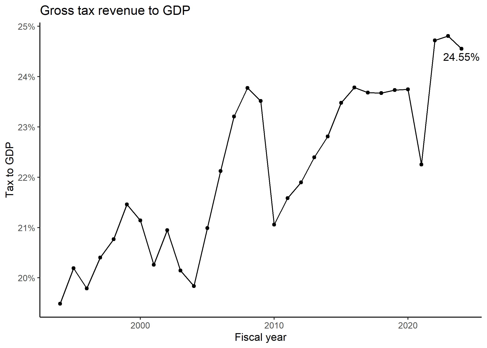
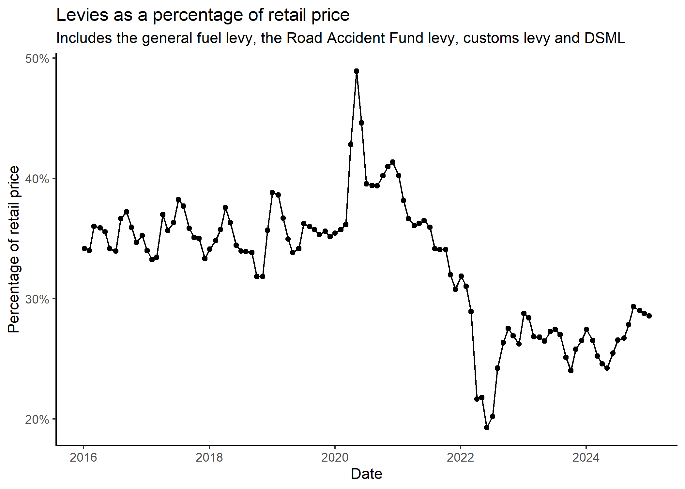

<!-- README.md is generated from README.Rmd. Please edit that file -->

# tax4sa

<!-- badges: start -->
<!-- badges: end -->

This is a minimal package to help with the compilation and analysis of
tax and economic data in South Africa. The package only contains seven
main sets of data, three functions and the personal income tax tables
from 1995/96 to 2024/25.

The data includes:

- Annual tax revenue collections from 1983/84, as published in the
  [Budget Reviews of the National
  Treasury](http://www.treasury.gov.za/documents/national%20budget/default.aspx)
- Monthly tax revenue collections from April 2002, as published in the
  [monthly financing statements of the National
  Treasury](http://www.treasury.gov.za/comm_media/press/monthly/default.aspx)
- Forecasts of the main tax instruments and GDP from 2005, as published
  in the [Budget Reviews of the National
  Treasury](http://www.treasury.gov.za/documents/national%20budget/default.aspx)
- Monthly trade data on imports and exports from January 2010 from the
  [South African Revenue
  Service](https://tools.sars.gov.za/tradestatsportal/data_download.aspx)
- Quarterly Bulletin data from the [South African Reserve
  Bank](https://www.resbank.co.za/en/home/publications/quarterly-bulletin1/download-information-from-xlsx-data-files)
- Montly releases of economic statistics from [Statistics South
  Africa](http://www.statssa.gov.za/?page_id=1847)
- Fuel pricing and levies from the [Department of Mineral Resources and
  Energy](http://www.energy.gov.za/files/esources/petroleum/petroleum_arch.html)

The three functions and the personal income tax tables are intended to
help with calculating tax liabilities, particularly when used with the
[administrative data from
SARS](https://sa-tied.wider.unu.edu/sites/default/files/pdf/SATIED_WP36_Ebrahim_Axelson_March_2019.pdf).

## Installation

You can install the package from [GitHub](https://github.com/) with:

``` r
# install.packages("remotes")
remotes::install_github("chrisaxelson/tax4sa")
```

## Data

The data can be accessed by entering either `NT_Budget_revenue`,
`NT_S32_revenue`, `SARB_Quarterly_Bulletin`,
`STATSSA_P0441_GDP`,`DMRE_fuel`, etc. and is in a tidy format to ease
analysis within R. The package needs to be reinstalled to update the
data. If you would like to load all the data into your environment to
check what is available, you can run:

``` r
library(tax4sa)
load_tax4sa_data()
```

### National Treasury

#### Revenue

The tax revenue data is split by three revenue classifications in
columns `T1`, `T2` and `T3` and all figures are in ZAR 000’s.

``` r
library(dplyr)
library(knitr)
library(kableExtra)

# Check revenue data
NT_Budget_revenue %>% 
  filter(Fiscal_year == 2023) %>%  
  select(T1:T3, Year, Revenue) %>% 
  mutate(Revenue = round(Revenue,0)) %>% 
  head(5) %>% 
  kable(format.args = list(big.mark = ","), 
        caption = "Annual tax revenue (R'000s)")
```

| T1                          | T2                      | T3                                                  | Year    |     Revenue |
|:----------------------------|:------------------------|:----------------------------------------------------|:--------|------------:|
| Taxes on income and profits | Personal income tax     | Personal income tax                                 | 2022/23 | 600,366,808 |
| Taxes on income and profits | Tax on corporate income | Corporate income tax                                | 2022/23 | 344,659,912 |
| Taxes on income and profits | Tax on corporate income | Secondary tax on companies/dividend withholding tax | 2022/23 |  38,118,709 |
| Taxes on income and profits | Tax on corporate income | Interest withholding tax                            | 2022/23 |     725,925 |
| Taxes on income and profits | Other                   | Interest on overdue income tax                      | 2022/23 |   4,633,907 |

Annual tax revenue (R’000s)

``` r

# And monthly
NT_S32_revenue %>% 
  filter(T3 == "Health promotion levy") %>% 
  select(Tax = T3, Month, Quarter, Year, Fiscal_year, Revenue) %>% 
  mutate(Year = as.character(Year),
         Fiscal_year = as.character(Fiscal_year)) %>% 
  tail(5) %>% 
  kable(format.args = list(big.mark = ","),
        caption = "Monthly health promotion levy revenue (R'000s)") 
```

| Tax                   | Month    | Quarter | Year | Fiscal_year |   Revenue |
|:----------------------|:---------|--------:|:-----|:------------|----------:|
| Health promotion levy | October  |       4 | 2023 | 2024        | 205,979.1 |
| Health promotion levy | November |       4 | 2023 | 2024        | 211,331.1 |
| Health promotion levy | December |       4 | 2023 | 2024        | 203,251.9 |
| Health promotion levy | January  |       1 | 2024 | 2024        | 220,330.8 |
| Health promotion levy | February |       1 | 2024 | 2024        | 176,129.5 |

Monthly health promotion levy revenue (R’000s)

Or you can download the annual and monthly data in one spreadsheet.

``` r
# This saves it in your current working directory
# download.file("https://raw.githubusercontent.com/chrisaxelson/tax4sa/master/data-raw/NT/Revenue.xlsx",
#               "Revenue.xlsx")
```

Similarly, you can access the forecasts that were made in the annual
Budget Reviews below.

``` r
# Check revenue data
NT_Budget_forecasts %>% 
  filter(Publication_year == 2023,
         Category == "Gross tax revenue") %>% 
   mutate(Publication_year = as.character(Publication_year)) %>% 
  kable(format.args = list(big.mark = ","), 
        caption = "Tax revenue forecasts (R million)")
```

| Source | Publication_year | Category          | Forecast_year |  Forecast |
|:-------|:-----------------|:------------------|:--------------|----------:|
| Budget | 2023             | Gross tax revenue | 2022/23       | 1,692,177 |
| Budget | 2023             | Gross tax revenue | 2023/24       | 1,787,456 |
| Budget | 2023             | Gross tax revenue | 2024/25       | 1,907,727 |
| Budget | 2023             | Gross tax revenue | 2025/26       | 2,043,456 |

Tax revenue forecasts (R million)

Or you can download the forecasts in one spreadsheet.

``` r
# This saves it in your current working directory
# download.file("https://raw.githubusercontent.com/chrisaxelson/tax4sa/master/data-raw/NT/Forecasts.xlsx",
#               "Forecasts.xlsx")
```

### South African Revenue Service

#### Trade data

The line-by-line trade data from the South African Revenue Service is
too large to be included directly in the package, but can be downloaded
separately per year of data and type of trade (imports or exports). Each
file is around 20MB.

The following code downloads the data into your working directory using
the
[piggyback](https://cran.r-project.org/web/packages/piggyback/vignettes/intro.html)
package. The data is likely to be too large to be loaded into R on most
computers, so it is saved as individual
[parquet](https://www.upsolver.com/blog/apache-parquet-why-use) files
where you can use [duckdb](https://duckdb.org/) to query all the data
without moving it into RAM. Any subsequent runs of the code will only
download updated data files.

``` r
library(piggyback)

# # Download individual files - can adjust imports to exports and the year
# pb_download("SARS_imports_2022.parquet", 
#             repo = "chrisaxelson/tax4sa")

# # Or download ALL the trade data from Github - about 600MB
# # If run again, will only download updated data
# pb_download(repo = "chrisaxelson/tax4sa")

# Quick example of how to access the data
library(duckdb)

# Create connection to temporary database in memory
con <- dbConnect(duckdb())

# Reference from all the parquet files in that folder
tbl(con, "SARS_*.parquet") %>% 
  head(5) %>% 
  mutate(YearMonth = as.character(YearMonth)) %>% 
  select(TradeType, District = DistrictOfficeName, Origin = CountryOfOriginName, Destination  = CountryOfDestinationName, Unit = StatisticalUnit,
         YearMonth, ChapterAndDescription, Quantity = StatisticalQuantity, Value_ZAR = CustomsValue) %>% 
  kable(format.args = list(big.mark = ","),
        caption = "Monthly trade data")
```

| TradeType | District    | Origin       | Destination | Unit | YearMonth | ChapterAndDescription                               | Quantity | Value_ZAR |
|:----------|:------------|:-------------|:------------|:-----|:----------|:----------------------------------------------------|---------:|----------:|
| Exports   | Beit Bridge | South Africa | Mozambique  | NO   | 202301    | 85 - Cellphones, Electrical Equipment and Machinery |     1.00 |   430,000 |
| Exports   | Beit Bridge | South Africa | Tanzania    | KG   | 202303    | 68 - Stone, plaster, cement and Asbestos            |   522.77 |    10,888 |
| Exports   | Beit Bridge | South Africa | Tanzania    | KG   | 202301    | 39 - Plastics and articles thereof                  | 1,593.60 |   254,518 |
| Exports   | Beit Bridge | South Africa | Mozambique  | NO   | 202303    | 85 - Cellphones, Electrical Equipment and Machinery |     1.00 | 1,138,889 |
| Exports   | Beit Bridge | South Africa | Mozambique  | NO   | 202302    | 90 - Medical and Photographic Equipment             |     2.00 |     3,859 |

Monthly trade data

## South African Reserve Bank

``` r
# Look for SARB economic data on GDP
SARB_Quarterly_Bulletin_info %>% 
  filter(grepl("Gross domestic product at market prices", Description), Frequency == "K1") %>%
  select(-Description, -Frequency) %>% 
  kable()
```

| Code     | Frequency_description | Unit_of_measure | Version_description                                      |
|:---------|:----------------------|:----------------|:---------------------------------------------------------|
| KBP6006C | Quarterly             | RMILL           | Constant 2010 prices                                     |
| KBP6006D | Quarterly             | RMILL           | Constant 2010 prices. Seasonally adjusted at annual rate |
| KBP6006K | Quarterly             | RMILL           | Current prices                                           |
| KBP6006L | Quarterly             | RMILL           | Current prices. Seasonally adjusted at annual rate       |
| KBP6006S | Quarterly             | PERC            | 1-Term % change                                          |

``` r

SARB_Quarterly_Bulletin %>% 
  filter(Code == "KBP6006K") %>% 
  select(-Month) %>% 
  tail(5) %>% 
  kable()
```

| Code     |     Date | Frequency | Quarter | Year | Fiscal_year |   Value |
|:---------|---------:|:----------|--------:|-----:|------------:|--------:|
| KBP6006K | 20220400 | K1        |       4 | 2022 |        2023 | 1694095 |
| KBP6006K | 20230100 | K1        |       1 | 2023 |        2023 | 1662363 |
| KBP6006K | 20230200 | K1        |       2 | 2023 |        2024 | 1745206 |
| KBP6006K | 20230300 | K1        |       3 | 2023 |        2024 | 1761770 |
| KBP6006K | 20230400 | K1        |       4 | 2023 |        2024 | 1800824 |

## Statistics South Africa

``` r
# Look for STATSSA inflation data
STATSSA_P0141_CPI_COICOP %>% 
  filter(H04 == "CPI Headline") %>%
  select(H01, H04, Date_original, Value) %>% 
  mutate(Annual_inflation = as.numeric(Value) / as.numeric(lag(Value, 12)) - 1,
         Annual_inflation = round(Annual_inflation * 100, 3)) %>% 
  tail(5) %>% 
  kable()
```

| H01   | H04          | Date_original | Value | Annual_inflation |
|:------|:-------------|:--------------|:------|-----------------:|
| P0141 | CPI Headline | MO032023      | 109   |            7.073 |
| P0141 | CPI Headline | MO042023      | 109.4 |            6.836 |
| P0141 | CPI Headline | MO052023      | 109.6 |            6.305 |
| P0141 | CPI Headline | MO062023      | 109.8 |            5.374 |
| P0141 | CPI Headline | MO072023      | 110.8 |            4.726 |

## Department of Mineral Resources and Energy

Note that the `Price` column reflects retail prices for unleaded petrol,
wholesale list prices for diesel and illuminating paraffin and maximum
retail price for liquified petroleum gas.

``` r
# Look for STATSSA inflation data
DMRE_fuel %>% 
  select(Fuel_type:General_fuel_levy) %>% 
  tail(10) %>% 
  kable()
```

| Fuel_type               | Region  | Date       |   Price | Basic_fuel_price | General_fuel_levy |
|:------------------------|:--------|:-----------|--------:|-----------------:|------------------:|
| 93_ULP                  | Gauteng | 2024-04-03 | 2478.00 |          1379.65 |               396 |
| 95_ULP                  | Coastal | 2024-04-03 | 2433.00 |          1379.65 |               396 |
| 95_ULP                  | Gauteng | 2024-04-03 | 2512.00 |          1379.65 |               396 |
| Diesel_0.005            | Coastal | 2024-04-03 | 2180.49 |          1404.03 |               384 |
| Diesel_0.005            | Gauteng | 2024-04-03 | 2259.49 |          1404.03 |               384 |
| Diesel_0.05             | Coastal | 2024-04-03 | 2166.09 |          1389.63 |               384 |
| Diesel_0.05             | Gauteng | 2024-04-03 | 2245.09 |          1389.63 |               384 |
| Illuminating_Paraffin   | Coastal | 2024-04-03 | 1519.74 |               NA |                NA |
| Illuminating_Paraffin   | Gauteng | 2024-04-03 | 1618.94 |               NA |                NA |
| Liquefied_Petroleum_Gas | Coastal | 2024-04-03 | 3516.00 |               NA |                NA |

## Functions

The three functions are `tax_calculation`, `pit` and `pit_manual`. The
first is a generic function to apply a tax table to a value, while the
latter two specifically calculate the personal income tax liability in
South Africa. `pit_manual` allows for a custom tax table to be applied
to cater for modelling the impacts of changes in the personal income tax
tables. The package includes a list of historical tax tables to be used
in the calculations.

``` r
# Accessing tax tables
tax_calculation(100000, Tax_tables$PIT_brackets_2024)
#> [1] 18000

# Calculate personal income tax
pit(income = 1000000, age = 53, mtc = 2550, tax_year = 2024)
#> [1] 289734

# Same calculation in a relatively large dataframe with differing variables
individuals <- 1e6
df <- data.frame(Taxable_income = round(runif(individuals, 0, 3000000),0),
                 Age = round(runif(individuals, 18, 80),0),
                 MTC = round(runif(individuals, 0, 6000), 0),
                 Tax_year = round(runif(individuals, 2014, 2020), 0))

system.time({
  df <- df %>% 
    mutate(Simulated_tax = pit(Taxable_income, Age, MTC, Tax_year))
})
#>    user  system elapsed 
#>    0.14    0.04    0.18
```

## Examples

``` r
library(tax4sa)
library(dplyr)
library(ggplot2)
library(scales)

# Create a tax to GDP chart - revenue per year first
Total_revenue <- NT_Budget_revenue %>% 
  group_by(Fiscal_year) %>% 
  summarise(Revenue = sum(Revenue))

# Get nominal GDP across fiscal year by summing per quarter
GDP_fiscal <- STATSSA_P0441_GDP %>% 
  filter(H03 == "QNU1000") %>% 
  group_by(Fiscal_year) %>% 
  summarise(GDP = sum(Value)) %>% 
  filter(Fiscal_year < 2024, Fiscal_year > 1993)

# Join together and create tax to GDP
Tax_to_GDP <- GDP_fiscal %>% 
  inner_join(Total_revenue, by = "Fiscal_year") %>% 
  mutate(Revenue = Revenue / 1000,
         Tax_to_GDP = Revenue / GDP)

# Chart
ggplot(Tax_to_GDP, aes(x = Fiscal_year, y = Tax_to_GDP)) +
  geom_line() + 
  geom_point() +
  geom_text(aes(label = ifelse(Fiscal_year == 2023, paste0(round(Tax_to_GDP,4) * 100, "%"),'')),
            hjust=0.5, vjust=-0.5, show.legend = FALSE) +
  scale_y_continuous(labels = scales::percent_format(accuracy = 1L)) +
  theme_classic() +
  ylab("Tax to GDP") +
  xlab("Fiscal year") +
  ggtitle("Gross tax revenue to GDP")
```



``` r
library(lubridate)

DMRE_fuel %>% 
  filter(Fuel_type == "95_ULP",
         Region == "Gauteng",
         Date > dmy("01012016")) %>% 
  ggplot(aes(x = Date, y = Price/100)) + 
  geom_line() +
  geom_point() +
  theme_classic() +
  ylab("Retail price (R/litre)") +
  ggtitle("Retail price of 95 unleaded petrol in Gauteng") +
  geom_text(aes(label = ifelse(Date == "2022-07-06", 
                               paste0("R", Price/100),'')),
            hjust=1.2, vjust=0.5, show.legend = FALSE)
```


``` r

DMRE_fuel %>% 
  filter(Fuel_type == "95_ULP",
         Region == "Gauteng",
         Date > dmy("01012016")) %>% 
  mutate(Tax = General_fuel_levy + 
           Road_accident_fund_levy + 
           Customs_and_excise_levy + 
           Demand_side_management_levy,
         Tax_percentage = Tax / Price) %>% 
  ggplot(aes(x = Date, y = Tax_percentage)) + 
  geom_line() +
  geom_point() +
  theme_classic() +
  scale_y_continuous(labels = scales::percent_format(accuracy = 1L)) +
  ylab("Percentage of retail price") +
  ggtitle("Levies as a percentage of retail price",
          subtitle = c("Includes the general fuel levy, the Road Accident Fund levy, customs levy and DSML")) 
#> Warning: Removed 13 rows containing missing values (`geom_line()`).
#> Warning: Removed 13 rows containing missing values (`geom_point()`).
```



<!-- ```{r cpi, message = FALSE} -->
<!-- # Get headline CPI index and check growth -->
<!-- CPI <- STATSSA %>%  -->
<!--   filter(Code == "CPS00000") %>%  -->
<!--   mutate(Value = as.numeric(Value),  -->
<!--          Change = Value / lag(Value, n = 12) - 1) -->
<!-- # Chart -->
<!-- ggplot(CPI, aes(x = Fiscal_year, y = Tax_to_GDP)) + -->
<!--   geom_line(color = "darkblue") +  -->
<!--   geom_point(color = "darkblue") + -->
<!--   scale_y_continuous(labels = scales::percent_format(accuracy = 1L)) + -->
<!--   theme_minimal() + -->
<!--   theme(axis.title.x = element_blank()) + -->
<!--   ylab("Tax to GDP") + -->
<!--   ggtitle("Total tax revenue to GDP") -->
<!-- ``` -->
